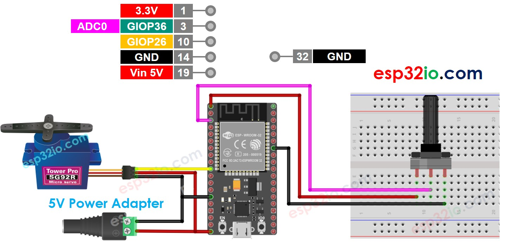
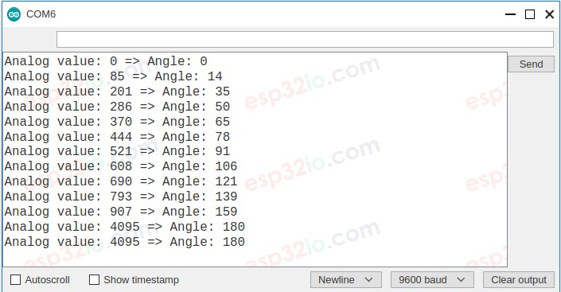

# ESP32 - Servo Motor controlled by Potentiometer

This tutorial instructs you how to use ESP32 with servo motor and potentiometer. In detail, the angle of a servo motor is in proportion with the value read from a potentiometer.

## Hardware Used In This Tutorial

  * 1	×	ESP-WROOM-32 Dev Module	
  * 1	×	Micro USB Cable	
  * 1	×	Servo Motor	
  * 1	×	Potentiometer	
  * 1	×	Breadboard	
  * 6	×	Jumper Wires

---

## Wiring Diagram



## ESP32 Code

```c++
#include <Servo.h>

#define PIN_POTENTIOMETER 36 // ESP32 pin GIOP36 (ADC0) onnected to potentiometer
#define PIN_SERVO         26 // ESP32 pin GIOP26 onnected to servo motor

Servo myServo;  // create servo object to control a servo

void setup() {
  // initialize serial communication at 9600 bits per second:
  Serial.begin(9600);

  myServo.attach(PIN_SERVO);  // attaches ESP32 pin to the servo object
}

void loop() {
  // reads the value of the potentiometer (value between 0 and 4095)
  int analogValue = analogRead(PIN_POTENTIOMETER);

  // scales it to use it with the servo (value between 0 and 180)
  int angle = map(analogValue, 0, 4095, 0, 180);

  // sets the servo position according to the scaled value
  myServo.write(angle);

  // print out the value
  Serial.print("Analog value: ");
  Serial.print(analogValue);
  Serial.print(" => Angle: ");
  Serial.println(angle);
  delay(100);
}

```

### Quick Instructions

  * If this is the first time you use ESP32, see how to setup environment for ESP32 on Arduino IDE.
  * Do the wiring as above image.
  * Connect the ESP32 board to your PC via a micro USB cable
  * Open Arduino IDE on your PC.
  * Select the right ESP32 board (e.g. ESP32 Dev Module) and COM port.
  * Copy the above code and paste it to Arduino IDE.
  * Compile and upload code to ESP32 board by clicking Upload button on Arduino IDE
  * Open Serial Monitor on Arduino IDE
  * Adjust the potentiometer
  * See the servo motor's rotation
  * See the result on Serial Monitor. It looks like the below:



