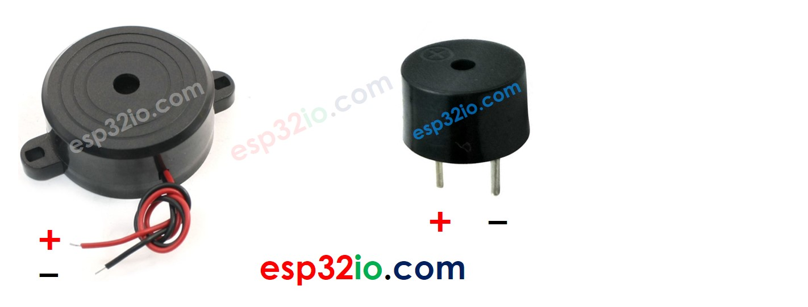

# ESP32 - Piezo Buzzer

This tutorial instructs you how to use ESP32 with piezo buzzer.


## Hardware Used In This Tutorial

  * 1	×	ESP-WROOM-32 Dev Module	
  * 1	×	Micro USB Cable	
  * 1	×	Piezo Buzzer	
  * 1	×	Breadboard	
  * n	×	Jumper Wires

---

## Introduction to Piezo Buzzer

The Piezo Buzzer is an electronic component that can make sound, beep or even play music.

### Piezo Buzzer Pinout

Piezo Buzzer usually includes two pins:

  * **Positive (+) pin**: The ESP32 generate the control signal to this pin
  * **Negative (-) pin**: connect this pin to GND (0V)



### How Piezo Buzzer Works

  * If connecting VCC to the positive pin, piezo buzzer generates the constant sound


  * If generating a square wave of the specified frequency (and 50% duty cycle) on the positive pin, the piezo buzzer generates tones. The different frequency makes a different tone. By changing the frequency of the signal on the positive pin, we can create the melody of a song.


---

## ESP32 Code

### Quick Instructions

  * If this is the first time you use ESP32, see how to setup environment for ESP32 on Arduino IDE.
  * Do the wiring as above image.
  * Connect the ESP32 board to your PC via a micro USB cable
  * Open Arduino IDE on your PC.
  * Select the right ESP32 board (e.g. ESP32 Dev Module) and COM port.
  * Copy the below code and paste to Arduino IDE

```c++
#include "pitches.h"
#define BUZZZER_PIN  18 // ESP32 pin GIOP18 connected to piezo buzzer

int melody[] = {
  NOTE_C4, NOTE_G3, NOTE_G3, NOTE_A3, NOTE_G3, 0, NOTE_B3, NOTE_C4
};

int noteDurations[] = {
  4, 8, 8, 4, 4, 4, 4, 4
};

void setup() {
  for (int thisNote = 0; thisNote < 8; thisNote++) {
    int noteDuration = 1000 / noteDurations[thisNote];
    tone(BUZZZER_PIN, melody[thisNote], noteDuration);

    int pauseBetweenNotes = noteDuration * 1.30;
    delay(pauseBetweenNotes);
    noTone(BUZZZER_PIN);
  }
}

void loop() {
}

```

  * Create the pitches.h file On Arduino IDE:


  * Either click on the button just below the serial monitor icon and choose New Tab, or use Ctrl+Shift+N.
  * Give file's name pitches.h and click OK button
  * Copy the below code and paste it to that file.

```c++
/*************************************************
 * Public Constants
 *************************************************/

#define NOTE_B0  31
#define NOTE_C1  33
#define NOTE_CS1 35
#define NOTE_D1  37
#define NOTE_DS1 39
#define NOTE_E1  41
#define NOTE_F1  44
#define NOTE_FS1 46
#define NOTE_G1  49
#define NOTE_GS1 52
#define NOTE_A1  55
#define NOTE_AS1 58
#define NOTE_B1  62
#define NOTE_C2  65
#define NOTE_CS2 69
#define NOTE_D2  73
#define NOTE_DS2 78
#define NOTE_E2  82
#define NOTE_F2  87
#define NOTE_FS2 93
#define NOTE_G2  98
#define NOTE_GS2 104
#define NOTE_A2  110
#define NOTE_AS2 117
#define NOTE_B2  123
#define NOTE_C3  131
#define NOTE_CS3 139
#define NOTE_D3  147
#define NOTE_DS3 156
#define NOTE_E3  165
#define NOTE_F3  175
#define NOTE_FS3 185
#define NOTE_G3  196
#define NOTE_GS3 208
#define NOTE_A3  220
#define NOTE_AS3 233
#define NOTE_B3  247
#define NOTE_C4  262
#define NOTE_CS4 277
#define NOTE_D4  294
#define NOTE_DS4 311
#define NOTE_E4  330
#define NOTE_F4  349
#define NOTE_FS4 370
#define NOTE_G4  392
#define NOTE_GS4 415
#define NOTE_A4  440
#define NOTE_AS4 466
#define NOTE_B4  494
#define NOTE_C5  523
#define NOTE_CS5 554
#define NOTE_D5  587
#define NOTE_DS5 622
#define NOTE_E5  659
#define NOTE_F5  698
#define NOTE_FS5 740
#define NOTE_G5  784
#define NOTE_GS5 831
#define NOTE_A5  880
#define NOTE_AS5 932
#define NOTE_B5  988
#define NOTE_C6  1047
#define NOTE_CS6 1109
#define NOTE_D6  1175
#define NOTE_DS6 1245
#define NOTE_E6  1319
#define NOTE_F6  1397
#define NOTE_FS6 1480
#define NOTE_G6  1568
#define NOTE_GS6 1661
#define NOTE_A6  1760
#define NOTE_AS6 1865
#define NOTE_B6  1976
#define NOTE_C7  2093
#define NOTE_CS7 2217
#define NOTE_D7  2349
#define NOTE_DS7 2489
#define NOTE_E7  2637
#define NOTE_F7  2794
#define NOTE_FS7 2960
#define NOTE_G7  3136
#define NOTE_GS7 3322
#define NOTE_A7  3520
#define NOTE_AS7 3729
#define NOTE_B7  3951
#define NOTE_C8  4186
#define NOTE_CS8 4435
#define NOTE_D8  4699
#define NOTE_DS8 4978
```

  * Compile and upload code to ESP32 board by clicking Upload button on Arduino IDE
  * Listen to the melody

---

## Modifying ESP32 Code

Lt's modidy the ESP32 code to play Jingle Bells song.

We only need to change value of two arrays: `int melody[]` and `int noteDurations[]`.

```c++
#include "pitches.h"
const int BUZZZER_PIN = 18; // GIOP18 pin connected to piezo buzzer

// notes in the melody:
int melody[] = {
  NOTE_E5, NOTE_E5, NOTE_E5,
  NOTE_E5, NOTE_E5, NOTE_E5,
  NOTE_E5, NOTE_G5, NOTE_C5, NOTE_D5,
  NOTE_E5,
  NOTE_F5, NOTE_F5, NOTE_F5, NOTE_F5,
  NOTE_F5, NOTE_E5, NOTE_E5, NOTE_E5, NOTE_E5,
  NOTE_E5, NOTE_D5, NOTE_D5, NOTE_E5,
  NOTE_D5, NOTE_G5
};

// note durations: 4 = quarter note, 8 = eighth note, etc, also called tempo:
int noteDurations[] = {
  8, 8, 4,
  8, 8, 4,
  8, 8, 8, 8,
  2,
  8, 8, 8, 8,
  8, 8, 8, 16, 16,
  8, 8, 8, 8,
  4, 4
};

void setup() {
  // iterate over the notes of the melody:
  int size = sizeof(noteDurations) / sizeof(int);

  for (int thisNote = 0; thisNote < size; thisNote++) {

    // to calculate the note duration, take one second divided by the note type.
    //e.g. quarter note = 1000 / 4, eighth note = 1000/8, etc.
    int noteDuration = 1000 / noteDurations[thisNote];
    tone(BUZZZER_PIN, melody[thisNote], noteDuration);

    // to distinguish the notes, set a minimum time between them.
    // the note's duration + 30% seems to work well:
    int pauseBetweenNotes = noteDuration * 1.30;
    delay(pauseBetweenNotes);
    // stop the tone playing:
    noTone(BUZZZER_PIN);
  }
}

void loop() {
  // no need to repeat the melody.
}

```