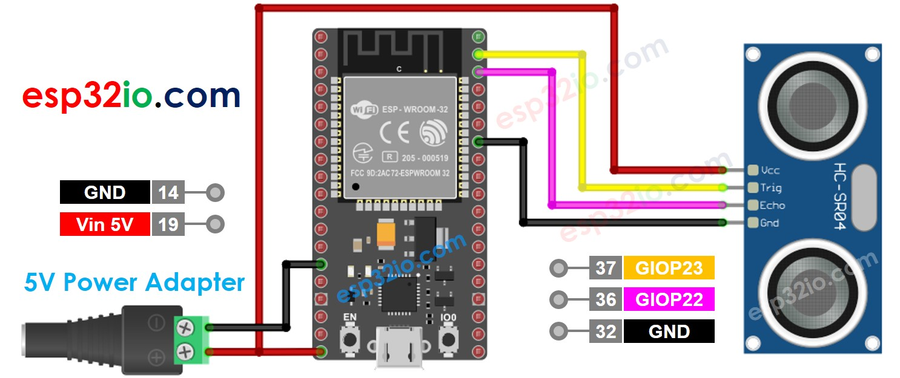

# ESP32 - Ultrasonic Sensor

This tutorial instructs you how to use ESP32 with the ultrasonic sensor HC-SR04 to measure the distance.

## Hardware Used In This Tutorial

  * 1	×	ESP-WROOM-32 Dev Module	
  * 1	×	Micro USB Cable	
  * 1	×	Ultrasonic Sensor	
  * 4	×	Jumper Wires

---

## Introduction to Ultrasonic Sensor

The ultrasonic sensor HC-SR04 is used to measure the distance from the sensor to an object by using ultrasonic waves.

### Ultrasonic Sensor Pinout

The ultrasonic sensor HC-SR04 includes four pins:

  * **VCC pin**: connect this pin to VCC (5V)
  * **GND pin**: connect this pin to GND (0V)
  * **TRIG pin**: this pin receives a control pulse from ESP32.
  * **ECHO pin**: this pin generates a pulse corresponding to the measured distance to ESP32.


---

## How Ultrasonic Sensor Works

  1. Micro-controller: generates a 10-microsecond pulse on the TRIG pin.
  2. The ultrasonic sensor automatically emits the ultrasonic waves.
  3. The ultrasonic wave is reflected after hitting an obstacle.
  4. The ultrasonic sensor:
      * Detects the reflected ultrasonic wave.
      * Measures the travel time of the ultrasonic wave.
  5. Ultrasonic sensor: generates a pulse to the ECHO pin. The duration of the pulse is equal to the travel time of the ultrasonic wave.
  6. Micro-controller measures the pulse duration in the ECHO pin, and then calculate the distance between sensor and obstacle.

[See Video](https://youtu.be/fWMb5nP-LkU)

## How to Get Distance From Ultrasonic Sensor

To get distance from the ultrasonic sensor, we only need to do two steps (1 and 6 on How It Works part)

  * Generates a 10-microsecond pulse on TRIG pin
  * Measures the pulse duration in ECHO pin, and then calculate the distance between sensor and obstacle

### Distance Calculation

We have:

  * The travel time of the ultrasonic wave (µs): `travel_time = pulse_duration`
  * The speed of the ultrasonic wave: `speed = SPEED_OF_SOUND = 340 m/s = 0.034 cm/µs`

So:

    The travel distance of the ultrasonic wave (cm): `travel_distance = speed × travel_time = 0.034 × pulse_duration`
    The distance between sensor and obstacle (cm): distance = `travel_distance / 2 = 0.034 × pulse_duration / 2 = 0.017 × pulse_duration`

---

## Wiring Diagram between Ultrasonic Sensor and ESP32

The wiring diagram with power supply from USB cable


The wiring diagram with power supply from 5v adapter



---

## How To Program Ultrasonic Sensor

Generate a 10-microsecond pulse in ESP32's pin by using `digitalWrite()` and `delayMicroseconds()` functions. For example, pin GIOP23:

```c++
digitalWrite(23, HIGH);
delayMicroseconds(10);
digitalWrite(23, LOW);
```

Measures the pulse duration (µs) in ESP32's pin by using pulseIn() function. For example, pin GIOP22:

```c++
duration_us = pulseIn(22, HIGH);
```

Calculate distance (cm):

```c++
distance_cm = 0.017 * duration_us;
```

## ESP32 Code

```c++
#define TRIG_PIN 23 // ESP32 pin GIOP23 connected to Ultrasonic Sensor's TRIG pin
#define ECHO_PIN 22 // ESP32 pin GIOP22 connected to Ultrasonic Sensor's ECHO pin

float duration_us, distance_cm;

void setup() {
  // begin serial port
  Serial.begin (9600);

  // configure the trigger pin to output mode
  pinMode(TRIG_PIN, OUTPUT);
  // configure the echo pin to input mode
  pinMode(ECHO_PIN, INPUT);
}

void loop() {
  // generate 10-microsecond pulse to TRIG pin
  digitalWrite(TRIG_PIN, HIGH);
  delayMicroseconds(10);
  digitalWrite(TRIG_PIN, LOW);

  // measure duration of pulse from ECHO pin
  duration_us = pulseIn(ECHO_PIN, HIGH);

  // calculate the distance
  distance_cm = 0.017 * duration_us;

  // print the value to Serial Monitor
  Serial.print("distance: ");
  Serial.print(distance_cm);
  Serial.println(" cm");

  delay(500);
}
```

### Quick Instructions

  * If this is the first time you use ESP32, see how to setup environment for ESP32 on Arduino IDE.
  * Copy the above code and paste it to Arduino IDE.
  * Compile and upload code to ESP32 board by clicking Upload button on Arduino IDE
  * Open Serial Monitor on Arduino IDE
  * Move your hand in front of ultrasonic sensor
  * See the distance from the sensor to your hand on Serial Monitor


---

## How to Filter Noise from Distance Measurements of Ultrasonic Sensor

The measurement result from ultrasonic sensor contains noise. In some application, the noised result causes the unwanted operation. We can remove noise by using the following algorithm:

  1. Taking multiple measurements and store in an array
  2. Sorting the array in ascending order
  3. Filtering noise
     * The some smallest samples are considered as noise → ignore it
     * The some biggest samples are considered as noise → ignore it
        ⇒ get average of the middle samples

The below example code takes 20 measurements

  * The five smallest samples are considered as noise → ignore it
  * The five biggest samples are considered as noise → ignore it
    ⇒ get average of the 10 middle samples (from 5th to 14th)

```c++
#define TRIG_PIN 23 // ESP32 pin GIOP23 connected to Ultrasonic Sensor's TRIG pin
#define ECHO_PIN 22 // ESP32 pin GIOP22 connected to Ultrasonic Sensor's ECHO pin

float filterArray[20]; // array to store data samples from sensor
float distance; // store the distance from sensor

void setup() {
  // begin serial port
  Serial.begin (9600);

  // configure the trigger and echo pins to output mode
  pinMode(TRIG_PIN, OUTPUT);
  pinMode(ECHO_PIN, INPUT);
}

void loop() {
  // 1. TAKING MULTIPLE MEASUREMENTS AND STORE IN AN ARRAY
  for (int sample = 0; sample < 20; sample++) {
    filterArray[sample] = ultrasonicMeasure();
    delay(30); // to avoid untrasonic interfering
  }

  // 2. SORTING THE ARRAY IN ASCENDING ORDER
  for (int i = 0; i < 19; i++) {
    for (int j = i + 1; j < 20; j++) {
      if (filterArray[i] > filterArray[j]) {
        float swap = filterArray[i];
        filterArray[i] = filterArray[j];
        filterArray[j] = swap;
      }
    }
  }

  // 3. FILTERING NOISE
  // + the five smallest samples are considered as noise -> ignore it
  // + the five biggest  samples are considered as noise -> ignore it
  // ----------------------------------------------------------------
  // => get average of the 10 middle samples (from 5th to 14th)
  double sum = 0;
  for (int sample = 5; sample < 15; sample++) {
    sum += filterArray[sample];
  }

  distance = sum / 10;

  // print the value to Serial Monitor
  Serial.print("distance: ");
  Serial.print(distance);
  Serial.println(" cm");
}

float ultrasonicMeasure() {
  // generate 10-microsecond pulse to TRIG pin
  digitalWrite(TRIG_PIN, HIGH);
  delayMicroseconds(10);
  digitalWrite(TRIG_PIN, LOW);

  // measure duration of pulse from ECHO pin
  float duration_us = pulseIn(ECHO_PIN, HIGH);

  // calculate the distance
  float distance_cm = 0.017 * duration_us;

  return distance_cm;
}

```

