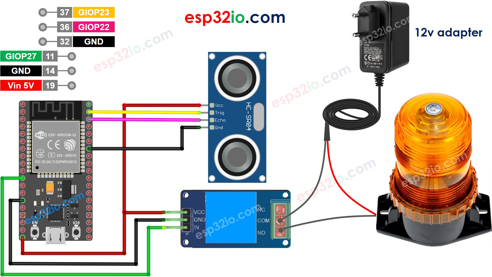

# ESP32 - Ultrasonic Sensor - Relay

This tutorial instructs you how to use ESP32 and Ultrasonic sensor to control the relay. In detail:

  * The ESP32 automatically turns relay on when an object is close to the ultrasonic sensor.
  * The ESP32 automatically turns relay off when an object is far from the ultrasonic sensor.

We can extend this tutorial to use the ultrasonic sensor to control a led strip, siren, light bulb, or motor... by connnecting them to the relay.

## Hardware Used In This Tutorial

  * 1	×	ESP-WROOM-32 Dev Module	
  * 1	×	Micro USB Cable	
  * 1	×	Ultrasonic Sensor	
  * 1	×	Relay	
  * 1	×	Warning Light Bright Waterproof	
  * 1	×	12V Power Adapter	
  * n	×	Jumper Wires

---

## Wiring Diagram



## ESP32 Code

```c++
#define TRIG_PIN   23 // ESP32 pin GIOP23 connected to Ultrasonic Sensor's TRIG pin
#define ECHO_PIN   22 // ESP32 pin GIOP22 connected to Ultrasonic Sensor's ECHO pin
#define RELAY_PIN  27 // ESP32 pin GIOP27 connected to Relay's pin
#define DISTANCE_THRESHOLD 50 // centimeters

// The below are variables, which can be changed
float duration_us, distance_cm;

void setup() {
  Serial.begin (9600);        // initialize serial port
  pinMode(TRIG_PIN, OUTPUT);  // set ESP32 pin to output mode
  pinMode(ECHO_PIN, INPUT);   // set ESP32 pin to input mode
  pinMode(RELAY_PIN, OUTPUT); // set ESP32 pin to output mode
}

void loop() {
  // generate 10-microsecond pulse to TRIG pin
  digitalWrite(TRIG_PIN, HIGH);
  delayMicroseconds(10);
  digitalWrite(TRIG_PIN, LOW);

  // measure duration of pulse from ECHO pin
  duration_us = pulseIn(ECHO_PIN, HIGH);
  // calculate the distance
  distance_cm = 0.017 * duration_us;

  if (distance_cm < DISTANCE_THRESHOLD)
    digitalWrite(RELAY_PIN, HIGH); // turn on Relay
  else
    digitalWrite(RELAY_PIN, LOW);  // turn off Relay

  // print the value to Serial Monitor
  Serial.print("distance: ");
  Serial.print(distance_cm);
  Serial.println(" cm");

  delay(500);
}
```

Quick Instructions

  * If this is the first time you use ESP32, see how to setup environment for ESP32 on Arduino IDE.
  * Do the wiring as above image.
  * Connect the ESP32 board to your PC via a micro USB cable
  * Open Arduino IDE on your PC.
  * Select the right ESP32 board (e.g. ESP32 Dev Module) and COM port.
  * Copy the above code and paste it to Arduino IDE.
  * Compile and upload code to ESP32 board by clicking Upload button on Arduino IDE
  * Move your hand in front of sensor
  * See the change of relay's state