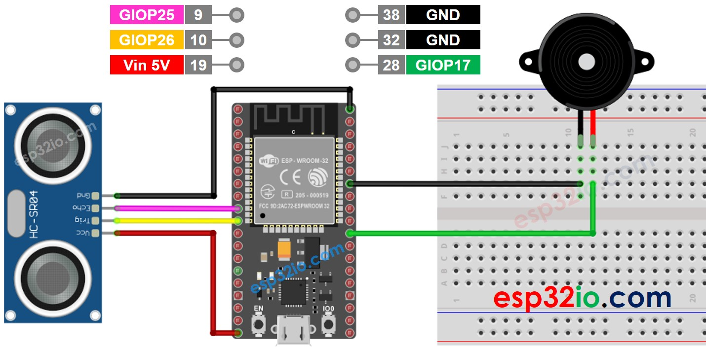
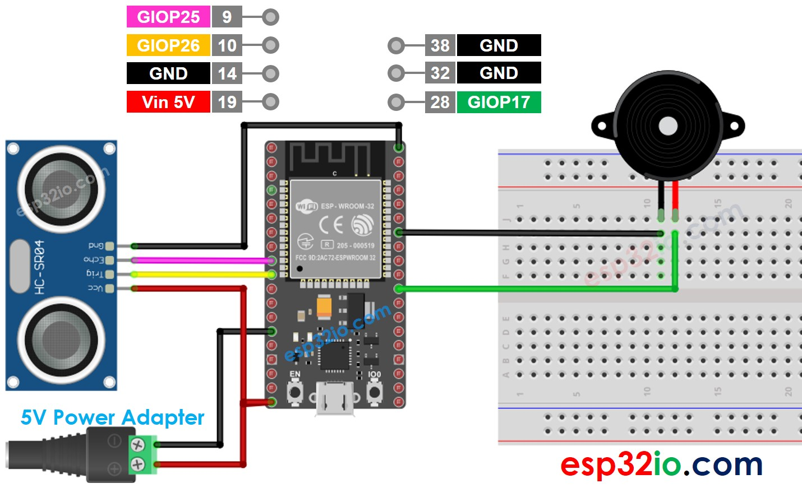

# ESP32 - Ultrasonic Sensor - Piezo Buzzer

This tutorial instructs you how to use ESP32 and the ultrasonic sensor to control the piezo buzzer. In detail:

  * The ESP32 automatically turns the piezo buzzer on if the object is close to ultrasonic sensor
  * The ESP32 automatically turns the piezo buzzer off if the object is far from ultrasonic sensor

## Hardware Used In This Tutorial

  * 1	×	ESP-WROOM-32 Dev Module	
  * 1	×	Micro USB Cable	
  * 1	×	Ultrasonic Sensor	
  * 1	×	Piezo Buzzer	
  * 1	×	Breadboard	
  * n	×	Jumper Wires

---

## Wiring Diagram

The wiring diagram with power supply from USB cable



The wiring diagram with power supply from 5v adapter



## ESP32 Code - Simple Sound

```c++
#define TRIG_PIN   26 // ESP32 pin GIOP26 connected to Ultrasonic Sensor's TRIG pin
#define ECHO_PIN   25 // ESP32 pin GIOP25 connected to Ultrasonic Sensor's ECHO pin
#define BUZZER_PIN 17 // ESP32 pin GIOP17 connected to Piezo Buzzer's pin
#define DISTANCE_THRESHOLD 50 // centimeters

// The below are variables, which can be changed
float duration_us, distance_cm;

void setup() {
  Serial.begin (9600);         // initialize serial port
  pinMode(TRIG_PIN, OUTPUT);   // set ESP32 pin to output mode
  pinMode(ECHO_PIN, INPUT);    // set ESP32 pin to input mode
  pinMode(BUZZER_PIN, OUTPUT); // set ESP32 pin to output mode
}

void loop() {
  // generate 10-microsecond pulse to TRIG pin
  digitalWrite(TRIG_PIN, HIGH);
  delayMicroseconds(10);
  digitalWrite(TRIG_PIN, LOW);

  // measure duration of pulse from ECHO pin
  duration_us = pulseIn(ECHO_PIN, HIGH);
  // calculate the distance
  distance_cm = 0.017 * duration_us;

  if (distance_cm < DISTANCE_THRESHOLD)
    digitalWrite(BUZZER_PIN, HIGH); // turn on Piezo Buzzer
  else
    digitalWrite(BUZZER_PIN, LOW);  // turn off Piezo Buzzer

  // print the value to Serial Monitor
  Serial.print("distance: ");
  Serial.print(distance_cm);
  Serial.println(" cm");

  delay(500);
}

```

### Quick Instructions

  * If this is the first time you use ESP32, see how to setup environment for ESP32 on Arduino IDE.
  * Do the wiring as above image.
  * Connect the ESP32 board to your PC via a micro USB cable
  * Open Arduino IDE on your PC.
  * Select the right ESP32 board (e.g. ESP32 Dev Module) and COM port.
  * Copy the above code and paste it to Arduino IDE.
  * Compile and upload code to ESP32 board by clicking Upload button on Arduino IDE
  * Move your hand in front of sensor
  * Listen to piezo buzzer's sound

---

## ESP32 Code - Melody

```c++
#include "pitches.h"

#define TRIG_PIN   26 // ESP32 pin GIOP26 connected to Ultrasonic Sensor's TRIG pin
#define ECHO_PIN   25 // ESP32 pin GIOP25 connected to Ultrasonic Sensor's ECHO pin
#define BUZZER_PIN 17 // ESP32 pin GIOP17 connected to Piezo Buzzer's pin
#define DISTANCE_THRESHOLD 50 // centimeters

// The below are variables, which can be changed
float duration_us, distance_cm;

// notes in the melody:
int melody[] = {
  NOTE_E5, NOTE_E5, NOTE_E5,
  NOTE_E5, NOTE_E5, NOTE_E5,
  NOTE_E5, NOTE_G5, NOTE_C5, NOTE_D5,
  NOTE_E5,
  NOTE_F5, NOTE_F5, NOTE_F5, NOTE_F5,
  NOTE_F5, NOTE_E5, NOTE_E5, NOTE_E5, NOTE_E5,
  NOTE_E5, NOTE_D5, NOTE_D5, NOTE_E5,
  NOTE_D5, NOTE_G5
};

// note durations: 4 = quarter note, 8 = eighth note, etc, also called tempo:
int noteDurations[] = {
  8, 8, 4,
  8, 8, 4,
  8, 8, 8, 8,
  2,
  8, 8, 8, 8,
  8, 8, 8, 16, 16,
  8, 8, 8, 8,
  4, 4
};

void setup() {
  pinMode(TRIG_PIN, OUTPUT);   // set ESP32 pin to output mode
  pinMode(ECHO_PIN, INPUT);    // set ESP32 pin to input mode
}

void loop() {
  // generate 10-microsecond pulse to TRIG pin
  digitalWrite(TRIG_PIN, HIGH);
  delayMicroseconds(10);
  digitalWrite(TRIG_PIN, LOW);

  // measure duration of pulse from ECHO pin
  duration_us = pulseIn(ECHO_PIN, HIGH);
  // calculate the distance
  distance_cm = 0.017 * duration_us;

  if (distance_cm < DISTANCE_THRESHOLD)
    buzzer(); // play a song

  delay(500);
}

void buzzer() {
  // iterate over the notes of the melody:
  int size = sizeof(noteDurations) / sizeof(int);

  for (int thisNote = 0; thisNote < size; thisNote++) {
    // to calculate the note duration, take one second divided by the note type.
    //e.g. quarter note = 1000 / 4, eighth note = 1000/8, etc.
    int noteDuration = 1000 / noteDurations[thisNote];
    tone(BUZZER_PIN, melody[thisNote], noteDuration);

    // to distinguish the notes, set a minimum time between them.
    // the note's duration + 30% seems to work well:
    int pauseBetweenNotes = noteDuration * 1.30;
    delay(pauseBetweenNotes);
    // stop the tone playing:
    noTone(BUZZER_PIN);
  }
}

```

### Quick Instructions

  * If this is the first time you use ESP32, see how to setup environment for ESP32 on Arduino IDE.
  * Copy the above code and paste it to Arduino IDE.
  * Create the `pitches.h` file On Arduino IDE
    * Either click on the button just below the serial monitor icon and choose "New Tab", or use Ctrl+Shift+N.
    * Give file's name "pitches.h" and click "OK" button
    * Copy the below code and paste it to that file.
  * Compile and upload code to ESP32 board by clicking Upload button on Arduino IDE
  * Move your hand in front of sensor
  * Listen to piezo buzzer's melody

  > **Note**
  >
  > The above code using `delay()` function. This blocks other code during playing melody. To avoid blocking other code, use the **ezBuzzer** library instead. This library is designed for buzzer to beep or play memody without blocking other code.