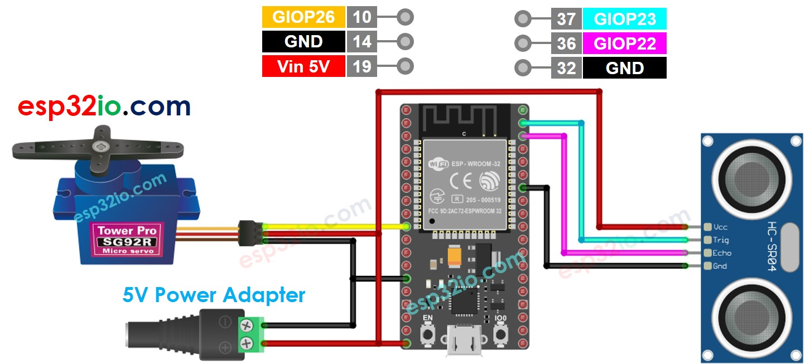

# ESP32 - Ultrasonic Sensor - Servo Motor

This tutorial instructs you how to use ESP32 with the potentiometer to control servo motor. In detail:

  * The ESP32 automatically rotates a servo motor to 90° if an object is close to ultrasonic sensor
  * The ESP32 automatically rotates a servo motor to back to 0° if an object is far from ultrasonic sensor

## Hardware Used In This Tutorial

  * 1	×	ESP-WROOM-32 Dev Module	
  * 1	×	Micro USB Cable	
  * 1	×	Ultrasonic Sensor	
  * 1	×	Servo Motor	
  * n	×	Jumper Wires

---

## Wiring Diagram



## ESP32 Code - Ultrasonic Sensor Controls Servo Motor

```c++
#include <Servo.h>

#define TRIG_PIN  23  // ESP32 pin GIOP23 connected to Ultrasonic Sensor's TRIG pin
#define ECHO_PIN  22  // ESP32 pin GIOP22 connected to Ultrasonic Sensor's ECHO pin
#define SERVO_PIN 26  // ESP32 pin GIOP26 connected to Servo Motor's pin
#define DISTANCE_THRESHOLD  50 // centimeters

Servo servo; // create servo object to control a servo

// The below are variables, which can be changed
float duration_us, distance_cm;

void setup() {
  Serial.begin (9600);       // initialize serial port
  pinMode(TRIG_PIN, OUTPUT); // set ESP32 pin to output mode
  pinMode(ECHO_PIN, INPUT);  // set ESP32 pin to input mode
  servo.attach(SERVO_PIN);   // attaches the servo on pin 9 to the servo object
  servo.write(0);
}

void loop() {
  // generate 10-microsecond pulse to TRIG pin
  digitalWrite(TRIG_PIN, HIGH);
  delayMicroseconds(10);
  digitalWrite(TRIG_PIN, LOW);

  // measure duration of pulse from ECHO pin
  duration_us = pulseIn(ECHO_PIN, HIGH);
  // calculate the distance
  distance_cm = 0.017 * duration_us;

  if (distance_cm < DISTANCE_THRESHOLD)
    servo.write(90); // rotate servo motor to 90 degree
  else
    servo.write(0);  // rotate servo motor to 0 degree

  // print the value to Serial Monitor
  Serial.print("distance: ");
  Serial.print(distance_cm);
  Serial.println(" cm");

  delay(500);
}

```

### Quick Instructions
 
  * If this is the first time you use ESP32, see how to setup environment for ESP32 on Arduino IDE.
  * Do the wiring as above image.
  * Connect the ESP32 board to your PC via a micro USB cable
  * Open Arduino IDE on your PC.
  * Select the right ESP32 board (e.g. ESP32 Dev Module) and COM port.
  * Copy the above code and paste it to Arduino IDE.
  * Compile and upload code to ESP32 board by clicking Upload button on Arduino IDE
  * Move your hand in front of sensor
  * See the change of servo motor


