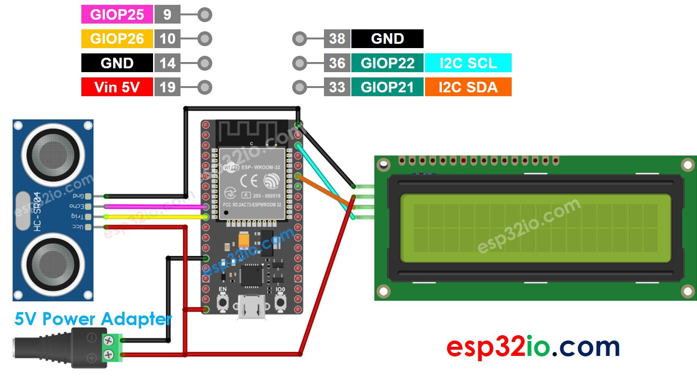
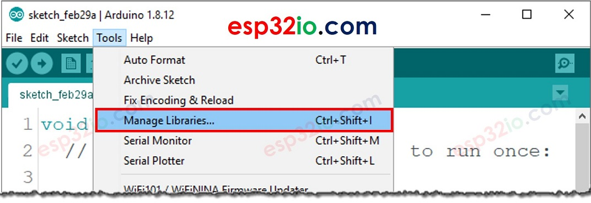
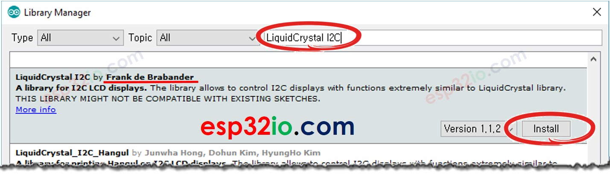

# ESP32 - Ultrasonic Sensor - LCD

This tutorial instructs you how to use ESP32 to measure distance and display it on LCD using Ultrasonic sensor.

## Hardware Used In This Tutorial

  * 1	×	ESP-WROOM-32 Dev Module	
  * 1	×	Micro USB Cable	
  * 1	×	LCD I2C	
  * 1	×	Ultrasonic Sensor	
  * n	×	Jumper Wires

---

## Wiring Diagram



## ESP32 Code

```c++
#include <LiquidCrystal_I2C.h>

LiquidCrystal_I2C lcd(0x3F, 16, 2); // I2C address 0x3F, 16 column and 2 rows

#define TRIG_PIN 26 // ESP32 pin GIOP26 connected to Ultrasonic Sensor's TRIG pin
#define ECHO_PIN 25 // ESP32 pin GIOP25 connected to Ultrasonic Sensor's ECHO pin

float duration_us, distance_cm;

void setup() {
  lcd.init();               // initialize the lcd
  lcd.backlight();          // open the backlight
  pinMode(TRIG_PIN, OUTPUT); // config trigger pin to output mode
  pinMode(ECHO_PIN, INPUT);  // config echo pin to input mode
}

void loop() {
  // generate 10-microsecond pulse to TRIG pin
  digitalWrite(TRIG_PIN, HIGH);
  delayMicroseconds(10);
  digitalWrite(TRIG_PIN, LOW);

  // measure duration of pulse from ECHO pin
  duration_us = pulseIn(ECHO_PIN, HIGH);

  // calculate the distance
  distance_cm = 0.017 * duration_us;

  lcd.clear();
  lcd.setCursor(0, 0); // start to print at the first row
  lcd.print("Distance: ");
  lcd.print(distance_cm);

  delay(500);
}

```

### Quick Instructions

  * If this is the first time you use ESP32, see how to setup environment for ESP32 on Arduino IDE.
  * Do the wiring as above image.
  * Connect the ESP32 board to your PC via a micro USB cable
  * Open Arduino IDE on your PC.
  * Select the right ESP32 board (e.g. ESP32 Dev Module) and COM port.

On Arduino IDE, Navigate to Tools Manage Libraries



  * Type *“LiquidCrystal I2C”* on the search box, then look for the *LiquidCrystal_I2C* library by Frank de Brabander
  * Click Install button to install LiquidCrystal_I2C library.



  * Copy the above code and paste it to Arduino IDE.
  * Compile and upload code to ESP32 board by clicking Upload button on Arduino IDE
  * Put the sensor on hot and cold water, or grasp the sensor by your hand
  * See the result in LCD

If LCD displays nothing, go to [Troubleshooting on LCD I2C](https://esp32io.com/tutorials/esp32-lcd#content_troubleshooting_on_lcd_i2c)