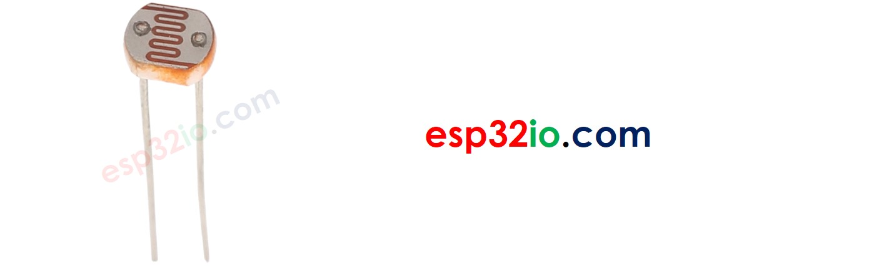
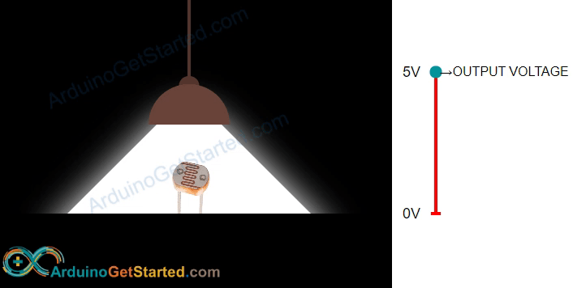
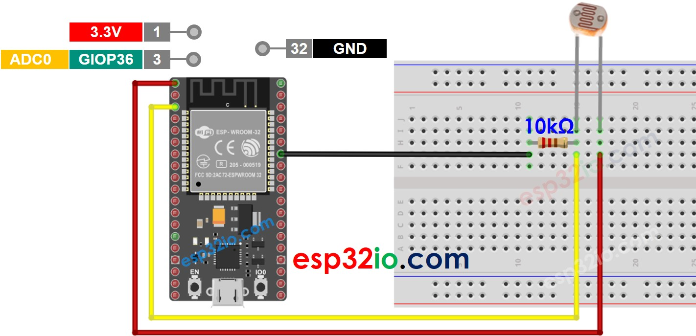
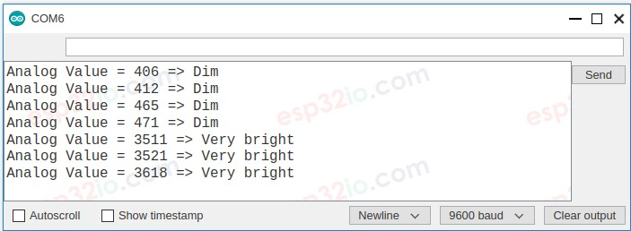

# ESP32 - Light Sensor

This tutorial instructs you how to use ESP32 with the light sensor. In detail, we will learn:

  * How light sensor works.
  * How to connect light sensor to ESP32.
  * How to program for ESP32 to read value from a light sensor.

## Hardware Used In This Tutorial

  * 1	×	ESP-WROOM-32 Dev Module	
  * 1	×	Micro USB Cable	
  * 1	×	Light Sensor	
  * 1	×	10 kΩ resistor	
  * 1	×	Breadboard	
  * n	×	Jumper Wires

---

## Introduction to Light Sensor

The most wide-used light sensor is a photoresistor (also known as photocell, or light-dependent resistor, LDR).

It can be used to detect the presence ofthe light. It can also be used to measure the illuminance/brightness level of the light.

### Light Sensor Pinout

A light sensor has two pins. Just like a normal resistor, We do NOT need to distinguish these pins.



### How Light Sensor Works

The photoresistor's resistance is in inverse proportion to the intensity of the light. The less light the photoresistor's face is exposed, the more the photoresistor's resistance is. Therefore, we can infer how bright the ambient light is by measuring the photoresistor's resistance.



   > **WARNING**
   >
   > The value measured by photoresistor reflects the approximated tendency of the light's intensity, it does NOT represent exactly the luminous flux. Therefore, the photoresistor should not be used in an application that requires high accuracy. calibration is also required for some kind application.

---

## ESP32 - Light Sensor

The ESP32's analog input pin converts the voltage (between 0v and ADC_VREF - default is 3.3V) into integer values (between 0 and 4095), called analog value or ADC value. By connecting an analog input pin of ESP32 to the photoresistor, we can read the analog value by using `analogRead()` function.

## Wiring Diagram between Light Sensor and ESP32



## ESP32 Code

The below ESP32 code reads the value from a light sensor and infers the light level

```c++
#define LIGHT_SENSOR_PIN 36 // ESP32 pin GIOP36 (ADC0)

void setup() {
  // initialize serial communication at 9600 bits per second:
  Serial.begin(9600);
}

void loop() {
  // reads the input on analog pin (value between 0 and 4095)
  int analogValue = analogRead(LIGHT_SENSOR_PIN);

  Serial.print("Analog Value = ");
  Serial.print(analogValue);   // the raw analog reading

  // We'll have a few threshholds, qualitatively determined
  if (analogValue < 40) {
    Serial.println(" => Dark");
  } else if (analogValue < 800) {
    Serial.println(" => Dim");
  } else if (analogValue < 2000) {
    Serial.println(" => Light");
  } else if (analogValue < 3200) {
    Serial.println(" => Bright");
  } else {
    Serial.println(" => Very bright");
  }

  delay(500);
}

```

### Quick Instructions

  * If this is the first time you use ESP32, see how to setup environment for ESP32 on Arduino IDE.
  * Copy the above code and paste it to Arduino IDE.
  * Compile and upload code to ESP32 board by clicking Upload button on Arduino IDE
  * Open Serial Monitor on Arduino IDE
  * Radiates light to sensor
  * See the result on Serial Monitor. It looks like the below:




---

## Light Sensor and LED

## Wiring Diagram


## ESP32 Code

The below code turns ON the LED if it is dark, otherwise turns OFF the LED

```c++
// The below are constants, which cannot be changed
#define LIGHT_SENSOR_PIN  36  // ESP32 pin GIOP36 (ADC0) connected to light sensor
#define LED_PIN           22  // ESP32 pin GIOP22 connected to LED
#define ANALOG_THRESHOLD  500

void setup() {
  pinMode(LED_PIN, OUTPUT); // set ESP32 pin to output mode
}

void loop() {
  int analogValue = analogRead(LIGHT_SENSOR_PIN); // read the value on analog pin

  if (analogValue < ANALOG_THRESHOLD)
    digitalWrite(LED_PIN, HIGH); // turn on LED
  else
    digitalWrite(LED_PIN, LOW);  // turn off LED
}

```