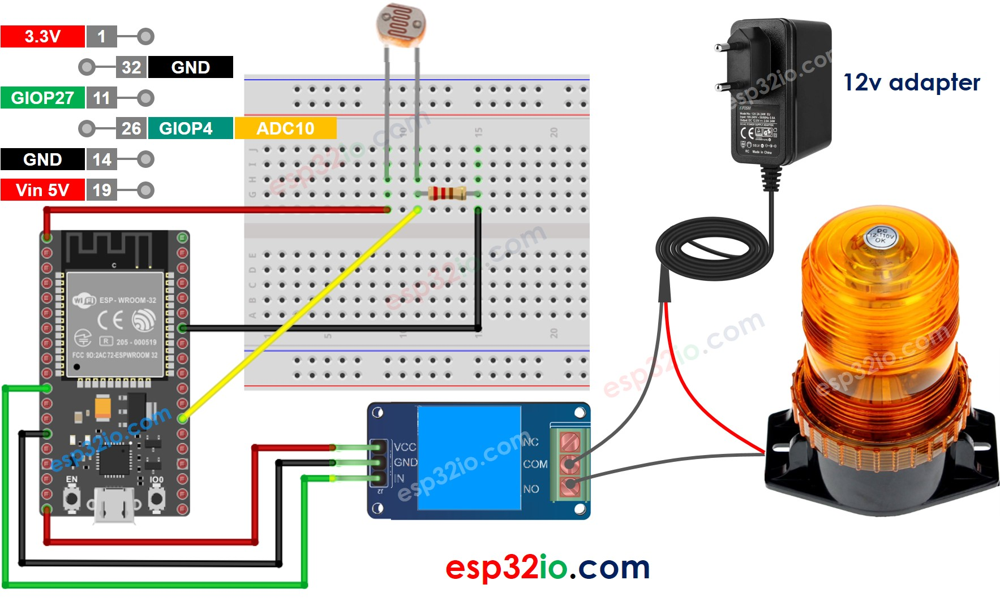

# ESP32 - Light Sensor Triggers Relay

This tutorial instructs you how to use ESP32, light sensor and relay to do a project that:

  * Turns relay on if the analog value measured from light sensor's is below a threshold,
  * Turns relay off if the analog value measured from light sensor's is above a threshold,

We can extend this tutorial to automatically turn on a led strip or light bulb when it is dark.

## Hardware Used In This Tutorial

  * 1	×	ESP-WROOM-32 Dev Module	
  * 1	×	Micro USB Cable	
  * 1	×	Light Sensor	
  * 1	×	10 kΩ resistor	
  * 1	×	Relay	
  * 1	×	Warning Light Bright Waterproof	
  * 1	×	12V Power Adapter	
  * 1	×	Breadboard	
  * n	×	Jumper Wires

---

## Wiring Diagram



## ESP32 Code

```c++
#define LIGHT_SENSOR_PIN  4  // ESP32 pin GIOP4 (ADC10) connected to light sensor
#define RELAY_PIN         27 // ESP32 pin GIOP27 connected to Relay
#define ANALOG_THRESHOLD  500

void setup() {
  pinMode(RELAY_PIN, OUTPUT); // set ESP32 pin to output mode
}

void loop() {
  int analogValue = analogRead(LIGHT_SENSOR_PIN); // read the value on analog pin

  if (analogValue < ANALOG_THRESHOLD)
    digitalWrite(RELAY_PIN, HIGH); // turn on Relay
  else
    digitalWrite(RELAY_PIN, LOW);  // turn off Relay
}

```

### Quick Instructions

  * If this is the first time you use ESP32, see how to setup environment for ESP32 on Arduino IDE.
  * Do the wiring as above image.
  * Connect the ESP32 board to your PC via a micro USB cable
  * Open Arduino IDE on your PC.
  * Select the right ESP32 board (e.g. ESP32 Dev Module) and COM port.
  * Copy the above code and paste it to Arduino IDE.
  * Compile and upload code to ESP32 board by clicking Upload button on Arduino IDE
  * Radiates light to sensor
  * See the change of relay's state