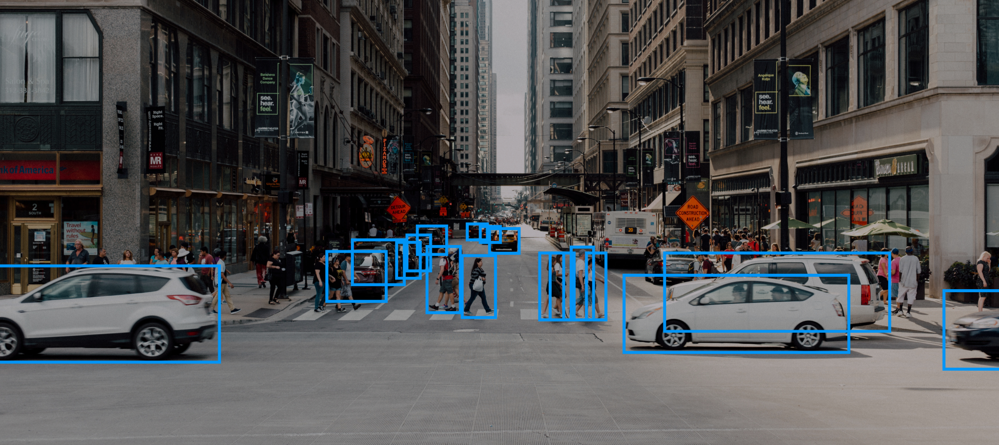
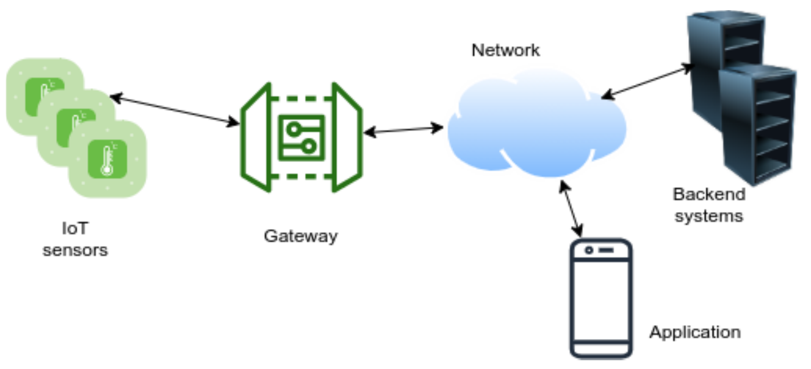

# Introduction to Internet Of Things

## The Internet of Things in a Nutshell

Nowadays, the internet is ubiquitous and people are dependent on it for their day-to-day life. Everyone has a phone in their pocket, which they can use to find any information they want in seconds. According to a study by Business Insider, on average, there will be four internet-connected devices per human by 2020.

Smart devices come in various forms and shapes and are causing disruptions in every industry, just like the internet did in the early 2000s. Companies such as Google and Samsung have been developing wearable devices, such as smartwatches and health trackers, automated robots for industrial applications, self-driving cars, smart buildings, and smart home devices, as well as early-warning systems for tsunamis or earthquakes.

---

## Exploring smart homes

The most prominent category of **Internet of Things (IoT)** devices for end consumers is **smart home** —connected electronic devices that are used in your flat or house. They often replace traditional electronic devices by enhancing them with an internet connection and a way to control them digitally. In most cases, they offer a smartphone app or integration with a smart home app, such as Google Home, which makes it possible, for example, to turn the device on and off from your sofa, change its settings, and check its status.

According to a study by [Zion Market Research](https://www.zionmarketresearch.com/news/smart-home-market), the global smart home market is about to reach around USD 53.45 billion by 2022, with big tech companies such as Samsung and Google being at the forefront. Let's look at some examples of these smart home devices:

  * Smart fridges
  * Smart door locks
  * Smart thermostats
  * Smart scales
  * Smart lights
  * Smart pet food dispensers

### How smart devices connect to the internet

In most cases, smart home devices need internet access to function correctly, which means that you must tell your device how it can connect to your local network via a network name and password.

When you first set up a new smart device in your household, the process often looks like this:

  1. You connect the smart device to a power source.
  1. The smart device goes into setup mode.
  1. The smart device opens an [ad hoc network](https://en.wikipedia.org/wiki/Wireless_ad_hoc_network).
  1. You connect to the network provided by the smart device via your smartphone. 
  1. On your smartphone, you visit a special website that is served by the smart device, and which is only accessible when you are connected to its network.
  1. You specify the network username and password on the website.
  1. The information is transmitted to the smart device.
  1. The smart device will close the temporary ad hoc network and connect to your normal network via the username and password you provided.
  1. The smart device can go online via your regular wireless network.

The very same technique can be used for creating IoT prototypes with microcontrollers, such as Arduino, Raspberry Pi, or Particle Photon, to create a convenient setup routine. We will not cover this technique in this book, but this is something to keep in mind if you're thinking about giving a prototype to friends and family or with batch production.

For example, if you were to bring your prototype to your friend's house, it would not be able to connect to the internet there, because it does not know the network name and password to connect with.

Without a setup routine like the one described previously, the source code of the device has to be modified each time the device is placed into a different environment to successfully connect to the other network.

---

## Exploring smart cars

Smart cars, another emerging field associated with IoT, is gaining momentum. Its progress is closely connected to the advancements made in machine learning in the last decade. If you have never heard about machine learning, you should put this book aside for a second and watch the TED talk The Rise of Artificial Intelligence through Deep Learning by Yoshua Bengio (https://www.youtube.com/watch?v=uawLjkSI7Mo). In a nutshell, machine learning makes it possible for computers to learn just like our brain does. It is another future technology that will be paired with IoT more and more to create smart, self-learning devices.

Machine learning is used in smart cars to develop many of its essential features:

  * Detect the street, other cars, and people
  * Understand signs and speed limits
  * Identify dangerous situations and know how to solve them (for example, by applying the brakes)

The following screenshot shows a simplified view of object detection in a smart car:

If you compare the visual interpretation of a human's view of a street and the digital representation of the same theme, the two differ enormously—a computer seeing through a camera just sees raw data, the amount of red, green, and blue per pixel, and nothing more. Machine learning makes this data more usable by training the computer based on input footage—for example, by supplying a large number of images depicting street views.

After many learning iterations, the computer might be able to identify a street using fresh footage. Machine learning and IoT will be good friends in the future as internet-enabled microcontrollers become smaller and more powerful.

Currently, complex machine learning models require an expensive state-of-the-art computer, but there are already experiments using the Raspberry Pi, a tiny computer that runs Linux, for simple machine learning tasks. Google and NVIDIA introduced two new development boards (so-called edge devices) in 2019, which have a similar form factor to the Raspberry Pi and are intended for machine learning prototyping: Google Coral and NVIDIA Jetson TX2.

But so-called on-device training is not the only way hardware devices can use the power of machine learning. The most common way they use machine learning today is by sending the device's data to a cloud server where the heavy analysis is done. One example of this is Google Photos. It allows you to upload your photos, in most cases taken with a smartphone, to the Google servers. The servers will analyze each and every one of them using various machine learning models.

You can already use the results in two ways, as:

  * The machine learning model detects all faces in a photo and groups them together into categories. This way you can easily find all photos that contain your face or any of your friends' faces.
  * The machine learning model detects objects in photos. You can then, for example, filter all of your images that contain a red car. 

Apart from machine learning, to understand their surroundings, smart cars can communicate with each other. Every now and then there are reports about a mass crash on the highway. Smart cars will be able to warn each other about dangerous situations: "Attention cars behind me. There is an obstacle lying on the street. Better slow down!".

When it comes to situations like this, the amount of time it takes for another car to receive this information can make the difference between life and death—one or even multiple seconds response time is just not good enough here, the response time needs to be in the milliseconds. If the cars were using the internet for communication, it might take too long. When sending data to a satellite and spreading it from there to all of the nearby cars, there are too many things that can go wrong and prevent the warning from being delivered in time. Fortunately, there is a solution for this: using a technology called Vehicle to Vehicle (V2V). With this technology, cars can talk directly to each other by opening a network themselves (like a router). Using this, they create a mesh of connected cars without needing internet access.

---

## Exploring industry 4.0 / the Industrial Internet of Things

Industry 4.0 refers to the fourth industrial revolution. One of its driving technologies is IoT, connecting physical machines digitally with each other and the cloud.

According to IoT Fundamentals: Networking Technologies, Protocols, and Use Cases for the Internet of Things, by David Hanes (et al.), (2017, Cisco Press), p 932-933, 1208-1209:

  > "There are estimates that there are 60 million machines in factories; the vast majority of them are more than 15 years old and 90% are not connected to the internet."

In the airplane industry, preflight security checks involved a lot of manual work—each and every piece of essential equipment had to be checked off a list for the flight to be considered safe. On average, this took 6.5 hours per plane.

By integrating RFID tags into essential safety equipment, for example, the airplane industry made it possible for security staff to use an RFID scanner instead of a paper checklist to make sure that no important parts are missing. 

And adding these chips was worth it. The 6.5 hours it took to manually check for the presence of each part could be reduced to 20 minutes this way.

There are many more industries less modern than the airplane industry that can profit from IoT as well.

By 2016, approximately 20 million smart meters had been installed globally, which can send their data automatically to the cloud. One of the areas where this is being used is power consumption in apartments.

Using smart meters and a web interface, tenants can check their monthly energy consumption. This way, it is easier to identify electronics or usage patterns that require a lot of energy, just by comparing the monthly costs.

Without smart meters, it is hard to tell whether the new electric grill you just bought is actually a power hog. You can imagine how much easier it is for the power companies as well: no need to send a technician from apartment to apartment, writing down numbers on paper that then have to be typed into a computer later.

Smart meters make everything much easier.

One of the areas where a lot of man-hours can be saved is semiautomatic maintenance of machines. Every machine part has a certain life expectancy: some fragile parts may last a few weeks, some several years. But sooner or later, physical parts need to be replaced. Most factories rely on their machines running in parallel—once one of them stops, the flow cannot go on.

Detecting machine parts that need to be replaced before they actually break can save the company a lot of analysis work and money. With self-monitoring machines, this is about to become more efficient and involve less human maintenance work. By equipping machines with various sensors to run self-tests and verify that all of their parts operate as planned, malfunctions or old parts can be identified early on by the machine. It can then call for a technician to replace part x or manually check part y. By pinpointing possible problems this way, machine downtime can be minimized.

The same self-analysis functions have found their way into the consumer market more and more as well. Commercial coffee machines have an internal counter that is incremented every time a coffee is made. After x coffees have been made, the machine might blink an LED to prompt you to run a manual maintenance program, for example, to get rid of unwanted deposits. While this isn't too smart, modern consumer 3D printers actually are. Being equipped with a multitude of sensors, they can detect malfunctions, identify broken parts, and fine-tune their own settings while printing.

---

## Voice control

With Apple's Siri, Microsoft's Cortana, Amazon's Alexa, and Google's Assistant, smart voice interfaces have found their way onto each of our smartphones, and they are about to be found in more and more gadgets in our homes.

The newest generation of smart speakers brings the vocal assistant as a key feature, not only allowing us to listen to our favorite tracks, streamed from Spotify via Bluetooth from our smartphones, but also acting as an interface to the web.

Using voice assistants to get the weather forecast for the day, find out what the capital of Finland is, or create a reminder to buy the milk makes these tasks a lot easier.

Natural voice interfaces open up a door to the connected world to control our homes and gain easy access to information. The technology is still young and full of flaws—many questions that you might ask the digital assistant are not understood yet, and result in an answer like "Sorry, I could not understand you. Did you mean…?". The complexity of conversations is also far off from resembling natural conversations between humans. Asking one of the voice assistants "How is the weather tomorrow?" is an easy task and the response will most likely be helpful to you and will let you know whether you should pack an umbrella or not. Asking a follow-up question such as "And the day after?" is a completely different problem and has not been supported until very recently.

Because of advancements in machine learning, these problems are about to be tackled, and the assistants get better each year, respond to more complex questions (and follow-up questions), and behave more and more like humans.

You might be wondering what all this has to do with IoT. When working on IoT projects, and especially wearables, you might have strict spacial restrictions. Let's say you want to create an LED necklace that can change color—being able to change the color would require physical buttons, which would take up extra space. It would also often feel hard to use without adding a display. This could already be too much to carry around. Using a voice assistant for this case would feel way more natural. The necklace could have one button to activate the assistant; once it is pressed, you could tell your necklace to change its color to blue, for example, using an external voice recognition service such as the Google Speech-to-Text API. From the API, you would then get the text blue back, which you could use in your Arduino code to actually switch the color.

Using external services and premade modules is one of the things I really want to push you toward. Creating a prototype is not about creating a consumer-grade product, ready to be produced in a batch of 50,000 in a factory in Shenzhen and hand-coded in tens of thousands of lines of code. Creating a prototype is about succeeding (or failing) fast in creating a functional prototype, either because you really want to build your own smart coffee maker or you want to find out whether that idea you had for your company might actually help with digitalization. Use whatever is available, hack it together. If one of the components is a proprietary voice recognition library, it is alright. If your prototype is doing well and you are thinking about bringing it to the next stage and actually producing it, you can still look for alternatives.

## What is IoT?

Although the definition of IoT might change slightly from different viewpoints, there are some key concepts in the IoT world that differentiate it from other types of technologies:

  * **Connectivity**: An IoT device is connected, either to the internet or to a local network. An old-style thermostat on the wall waiting for manual operation with basic programming features doesn't count as an IoT device.
  * **Identification**: An IoT device is uniquely identified in the network so that data has a context identified by that device. In addition, the device itself is available for remote update, remote management, and diagnostics.
  * **Autonomous operation**: IoT systems are designed for  minimal or no human intervention. Each device collects data from the environment where it is installed, and it can then communicate the data with other devices to detect the current status of the system and respond as configured. This response can be in the form of an action, a log, or an alert if required.
  * **Interoperability**: Devices in an IoT solution talk to one another, but they don't necessarily belong to a single vendor. When devices designed by different vendors share a common application-level protocol, adding a new device to that heterogeneous network is as easy as clicking on a few buttons on the device or on the management software.
  * **Scalability**: IoT systems are capable of horizontal scalability to respond to an increasing workload. A new device is added when necessary to increase capacity instead of replacing the existing one with a superior device (vertical scalability).
  * **Security**: I wish I could say that every IoT solution implements at least the minimal set of mandatory security measures, but unfortunately, this is not the case, despite a number of bad experiences, including the infamous Mirai botnet attack. On a positive note, I can say that IoT devices mostly have secure boot, secure update, and secure communication features to ensure confidentiality, integrity, and availability the (CIA triad).

Gartner added IoT in the 2011 hype cycle, with the expectation of more than 10 years to mainstream adoption. However, many related technologies, such as RFID, mesh networking, and Bluetooth, were already on the list many years before 2011, along with enablers such as mobile and cloud technologies. Since then, Gartner has added several other IoT technologies and applications to its list, including the following:

  * IoT platform
  * Connected home
  * Smart dust
  * Edge computing
  * Low-cost, single-board computers at the edge

5G and embedded AI are other revolutionary technologies on the Gartner list that support IoT and expand its area of application.

---

## Where do we apply IoT?

The application areas are vast, but conceptually speaking, we can group them into two basic categories:

  * In the **consumer IoT** category, we can see mainly smart home and security systems, personal healthcare products, wearable technologies, and asset tracking applications.
  * The **industrial IoT** category has more application areas, as you might expect. Every year, IoT Analytics publishes a top-10 trend list for industrial applications by reviewing thousands of new projects and the 2020 list contains manufacturing, transportation, energy, retail, cities, healthcare, supply chain, agriculture, and building applications in that order [IoT applications](https://iot-analytics.com/top-10-iot-applications-in-2020).

---

## AI/ML on the edge

AI has been around for a long time and there are many successful examples of machine vision, Natural Language Processing (NLP), speech recognition, and ML projects. However, they all require energy-hungry powerful hardware to be able to cope with CPU and memory-intensive calculations, which is not possible with humble sensor devices that have much less memory and processing power. TensorFlow Lite addresses this problem. Its converter can output a model, a set of rules to make predictions by running data through them, with a size as low as 14 KB to fit into any modern microcontroller, such as an ARM Cortex-M3 device with a very low power consumption, which enables you to have battery-operated sensor devices with ML capabilities. One interesting project comes from Benjamin Cabé (on Twitter: @kartben). In his project, he managed to train a model to discern different types of spirits with an accuracy of 92%. He used a Wio Terminal from SeeedStudio as the computing board, which has an ARM Cortex-M4F core running at 120 MHz.

Implications are enormous. Instead of a dummy sensor device, now we have the capability of developing a real smart device such that it can add meaning to data it collects and  can react based not only on data, but also the meaning. Benjamin employed a simple gas sensor to detect various gases, such as carbon monoxide (CO), nitrogen dioxide (NO2), ethyl alcohol (C2H5CH), and some other types. But the device itself can understand what it actually smells, thanks to the ML model it uses in its firmware. Without such a capability, the device would have to send its data to another more powerful machine or a cloud to make this analysis and then wait for a reply to decide what to do next. Moreover, if it loses its network connectivity somehow, nothing could be done more until connectivity is restored.

This subject definitely deserves another book, but if you want to do some experiments, ESP32 is also on the list of supported platforms on the TensorFlow Lite website.

---

## Energy harvesting

A vital discussion and research subject for Wireless Sensor Networks (WSNs) has always been the energy consumption of sensor nodes. Obviously, less is better. If you have some experience with the development of battery-operated wireless devices, you know the concept of run to sleep, which means do the job and go into sleep mode as soon as possible to preserve the most valuable resource, energy. Nonetheless, whatever you do, sensor nodes must consume energy and the user will have to replace the batteries after a while. An interesting technology comes to your aid at this point – energy harvesting, which has been around since the days of Nikola Tesla. The energy can be harvested from various ambient sources, including light, vibration, and wireless energy sources. To do that, a harvesting solution first needs to access that ambient energy by means of various components, depending on the energy type.

It is an RF antenna if the energy comes from an RF source, or a photovoltaic cell if light is the source. Then, this raw electrical energy has to be converted with the help  of an integrated circuit in order to store it in a capacitor or a battery. But you know that this is easier said than done. Although there are several Power Management integrated Circuits (PMICs) from different silicon vendors on the market, it is hard to say whether they solve this problem efficiently. The major challenges are very low levels of energy to harvest, the need to boost the very low voltage to higher logic levels, the need for multiple external components to operate, and a large chip footprint on the PCB. Therefore, these challenges have prevented vendors from producing high-performance energy harvesting chips. One product does sound promising, though.

Nowi Energy promotes its NH2D0245 PMIC as the most efficient and the smallest footprint power management IC compared to other semiconductor giants on the market. To prove their arguments, they launched a hybrid smartwatch module together with the module company MMT, such that a watch with that module requires no charge to operate during its lifetime. Energy harvesting is a hot topic, so there are, of course, competitors, such as e-peas semiconductors from Belgium. You might want to try one of those PMICs in your next WSN project.

---

## Nanorobotics

Before we move on, we should look at one last project, a research project from Cornell University. The result of this research has been published in Nature Journal in August 2020 as an article named Electronically integrated, mass-manufactured, microscopic robots. They invented actuators on a nano scale that you literally cannot see with your eyes. The super tiny structure has two solar cells on it to move the legs, and when laser beams are dropped on those solar cells, they generate enough voltage to activate the legs. Although not ready for any practical application as yet, this research is definitely on my follow-up list as a technologist and IoT expert.

  > [March of the microscopic robots](https://www.youtube.com/watch?v=2TjdGuBK9mI)

---

## Understanding the basic structure of IoT solutions

An IoT solution combines many different technologies into a single product, starting from a physical device and covering all layers up to end user applications. Each layer of the solution aims to implement the same vision set by the business, but requires a different approach while designing and developing. We definitely cannot talk about one-size-fits-all solutions in IoT projects, but we still can apply an organized approach to develop products. Let's see which layers a solution has in a typical IoT product:

  * **Device hardware**: Every IoT project requires hardware with a **System-On-Chip (SoC)** or **Microcontroller Unit (MCU)** and sensors/actuators to interact with the physical world. In addition to that, every IoT device is connected, so we need to select the optimal communication medium, such as wired or wireless. Power management is also another consideration under this category.
  * **Device firmware**: We need to develop device firmware to run on the SoC in order to fulfill the project's requirements. This is where we collect data and transfer it to the other components in the solution.
  * Communication: Connectivity issues are handled in this category of the solution architecture. The physical medium selection corresponds to one part of the solution, but we still need to decide on the protocol between devices as a common language for sharing data. Some protocols may provide a whole stack of communication by defining both the physical medium up to the application layer. If this is the case, you don't need to worry about anything else, but if your stack leaves the context management at the application layer up to you, then it is time to decide on what IoT protocol to use.
  * **Backend system**: This is the backbone of the solution. All data is collected on the backend system and provides the management, monitoring, and integration capabilities of the product. Backend systems can be implemented on on-premises hardware or cloud providers, again depending on the project requirements. Moreover, this is where IoT encounters other disruptive technologies. You can apply big data analytics to extract deeper information from data coming from sensors, or you can use AI algorithms to feed your system with more smart features, such as anomaly detection or predictive maintenance.
  * **End user applications**: You will very likely require an interface for your end users to let them access the functionality. 10 years ago, we were only talking about desktop, web, or mobile applications. But today we have voice assistants. You can think of them as a modern interface for human interaction, and it might be a good idea to add voice assistant integration as a feature, especially in the consumer segment.

Teh following diagram depicts the general structure of IoT solutions:

---

## IoT security

One important consideration that remains is security. Actually, it is all about security. I cannot overemphasize its importance whatever I write. IoT devices are connected to the real world and any security incident has the potential for serious damage in the immediate environment, let alone other cybersecurity crimes. Therefore, it should always be in your checklist while designing any hardware or software components of the solution. Although security, as a subject, definitely deserves a book by itself, I can list some golden rules for devices in the field:

  * Always look to reduce the attack surface for both hardware and firmware.
  * Prevent physical tampering wherever possible. No physical port should be open if this is not necessary.
  * Keep secret keys on a secure medium.
  * Implement secure boot, secure firmware updates, and encrypted communication.
  * Do not use default passwords; TCP/IP ports should not be open unnecessarily.
  * Put health check mechanisms in place along with anomaly detection where possible.

We should embrace secure design principles in general as IoT developers. Since an IoT product has many different components, end-to-end security becomes the crucial point while designing the product. A risk impact analysis should be done for each component to decide on the security levels of data in transit and data at rest. There are many national/international institutions and organizations that provide standards, guidelines, and best practices regarding cybersecurity. One of these, which works specifically on IoT technology is the IoT Security Foundation. They are actively developing guidelines and frameworks on the subject and publishing many of those guidelines, which are freely available.

