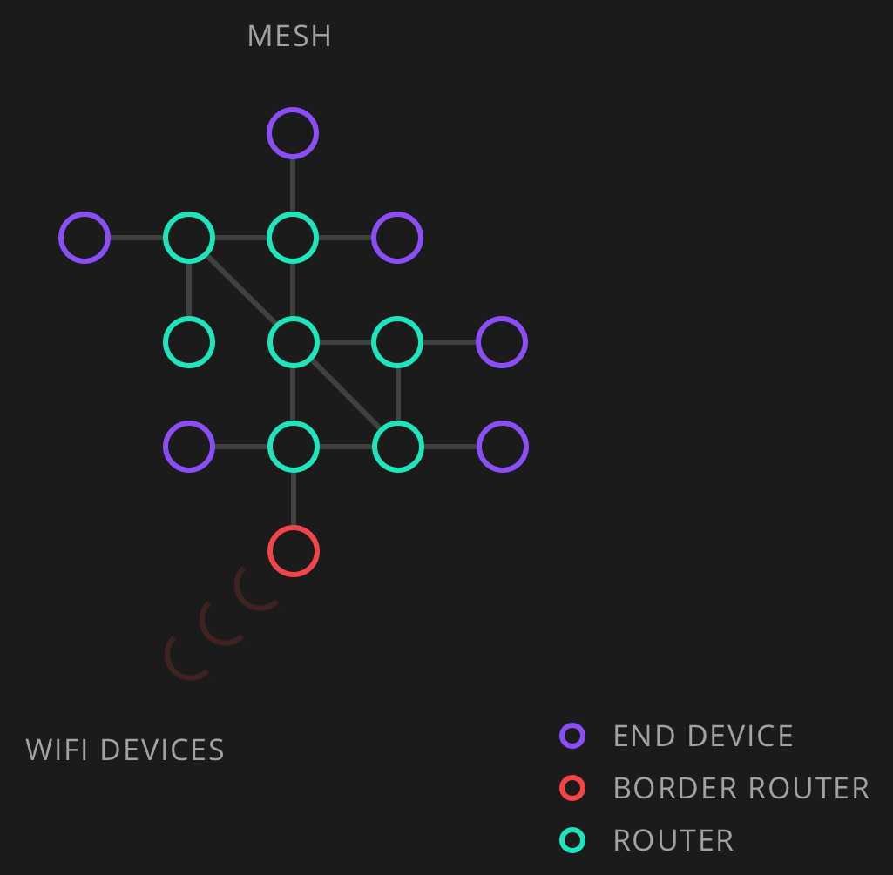

## Basic Architecture of an IoT Prototype

Here, you will be introduced to the basic building blocks of an IoT project. You will briefly get to know various protocols, architectures, and development boards for IoT prototyping. The main purpose of this section is to show you what's out there, so you can decide which technologies might be of interest for your next project and give you a head start on further exploration. If you feel overwhelmed by the number of new technologies and options available, don't be. You don't need to understand everything here, but hopefully you will come back later to look up one or more topics if you stumble upon them elsewhere.

After reading this section, you will have a better idea of technologies relevant to IoT prototyping. For many of the topics mentioned here, you will also find (at the end of this chapter) additional articles or videos that go into more detail.

The following topics will be covered in this section:

  * Building blocks of IoT connectivity
  * Understanding protocols and communication
  * Exploring microcontrollers for IoT

---

## Building blocks of IoT connectivity

One thing all IoT devices have in common is connectivity. In most cases, this means that the device can connect to the internet; in some cases, it might communicate with a local smart hub via another technology such as Bluetooth, which is connected to the internet itself, and sometimes devices from a local network, for example, via radio (see the ZigBee and Thread sections). In each case, there is a communication channel, so devices can either send out data, receive commands, or both.

Having a device that is connected to the internet or another device is much use. It needs to be connected to input and output components. With sensors as input components alone, there are a gazillion possibilities. 

For your device to interact with other devices (for example, a web server) on the internet, your device needs to be identifiable. Humans have names. If I am in a room with five people, each of us with a different name, Lisa will know that I am talking to her when calling her by name. Let's say I could scream very loudly and everybody in my city would hear me—screaming "Lisaaaaaa!" would be problematic, because there are 16,923 Lisas living in my city. To address her in a bigger network, I need a unique identifier, for example, an email address. For smart devices, the unique identifier is often its IP address, a number such as 123.45.123.45, which is unique across the globe and is automatically assigned by your internet provider. If your smart device interacts with a web server, such as "Hey weather.com, smart mirror here, please tell me how hot it will be today in Berlin, so I can display it", the server needs the IP address of your device to send back the information your device is requesting: "Sure buddy, it will be 23° today, but pack the umbrella!". In addition to the IP address, which might be different each time your device goes online, you probably want to interact with another server. In our case, this will mostly be a third-party server used to store and exchange data, something we gladly do not have to code ourselves when prototyping our smart device. There are many ways to store information for free on the internet; for example, we could create a spreadsheet document in Google Drive and write down our sensor data there. But there are better options, specifically designed for machines communicating with other machines, on your custom-made smart devices. These services offer an Application Programming Interface (API ) for your device to interact with. Often, these APIs use the CRUD pattern, which stands for Create, Read, Update, and Delete. When working on Arduino projects, two kinds of third-party web services are particularly relevant to us: data storage solutions and webservices to visualize your data. When working on hardware projects that collect sensor data, you need a place to store it. In many cases you want to store this information using a third party webservice that puts your data in a database and offers a way for you to access it, often in a tabular view, where you can inspect the raw data or download it. Here, visualization webservices come into play—they allow you to import your data and visualize it using graphs. This allows you to make sense of your data and visually inspect it, which often reveals hidden information that would remain uncovered when just looking at the raw data.

Some webservices combine another two features: they offer a way for you to store your sensor data and, at the same time, visualize it.

Programming web servers is not easy, so we can be happy that this part is taken care of for our prototypes and we don't have to think too much about it: we just have to choose one to use. There are many options available today for cloud services targeted at makers and hardware start-ups. Within a day, you can try them out and decide for yourself which one you like the most. In general, I would stick with those targeted at makers and try to avoid the big players such as AWS and Google Cloud, because they are targeted at big companies and add a lot of complexity to your projects.

More and more microcontroller manufactures have their own cloud service for you to log sensor data. For example, Particle, a leading manufacturer of microcontrollers for IoT, has its own cloud service called Device Cloud (https://www.particle.io/device-cloud/). Adafruit, another manufacturer of microcontrollers, as well as a web shop for makers, offers Adafruit IO (https://io.adafruit.com). Similar to the Particle cloud, it can be used to log data and visualize it in a web-based dashboard. Adafruit IO is compatible with MQTT, so you could use it as a place to store your MQTT-powered projects' data. Another handy feature of Adafruit IO is the possibility to set up notifications via triggers. Most of these services are logic-less though, meaning that you can store data, for example, temperature: 5°C, but you cannot create rules as follows:

  > ```
  > if temperature < 5° {
  >    send me a reminder to use beanie and gloves
  > }
  > ```

For logic to act upon your data, you either need to create rules on your device itself or integrate a third-party service such as IFTTT (If This Then That, https://ifttt.com).

---

## Client-server architecture

To see the possibilities of IoT prototyping, it is important to understand the client-server architecture. Client server architecture: Multiple clients send and receive information to one server
A client can be basically any device that is connected to the internet—smartphone, tablet, notebook, custom Arduino device, or another smart device.


### Web interface

To control your IoT device, you will need some sort of interface that can either be a website, smartphone app, or desktop app. 

### Application Programming Interface

APIs glue the web together. They are a way for computers to communicate with one another. While building physical IoT prototypes, you will deal a lot with third-party APIs. You might interact with a logging service such as ThingSpeak (https://thingspeak.com/) to store your sensor data in the cloud; log special events, for example, when your device encountered a sensor peak, in Google Calendar; or receive the latest stock prices to be displayed in a smart mirror—all via APIs. On the other hand, you might want to create an API for your own smart device, so other machines are able to interact with it.

---

## Understanding protocols and communication

In this section, we will have a look at four common protocols and technologies used for communication between IoT devices. ZigBee and Thread are both technologies that use radio to transmit information. ZigBee has long been the preferred way to transmit information between devices locally (without using the internet, but using radio signals), but is about to be replaced by Thread.

CoAP and MQTT, on the other hand, communicate over the internet. They are both intended to be used with constrained devices and have different areas where each protocol shines.

### ZigBee

ZigBee is a specification for local networks using low-power radio signals. It is used in home automation and sensor networks when multiple devices need to talk to one another in relatively close proximity (10-100 m line of sight) without an internet connection. Using ZigBee, mesh networks can be formed, bridging longer distances to transmit information via intermediate nodes. Each device in a ZigBee network needs to be set up as a coordinator, router, or end device. Each ZigBee network needs to have exactly one coordinator, which forms the root of the network. Router nodes are able to forward data between nodes, as well as consume and send data, while end notes consume or send data.

In the following screenshot, you can see various networks formed using ZigBee end devices, coordinators, and routers:


### CoAP

Constrained Application Protocol (CoAP) is an IoT protocol for machine-to-machine communication. It has its roots in the HTTP protocol, which we talked about before—HTTP is the queen of internet protocols and is used to access content via web browsers.

CoAP follows the RESTful architectural model we briefly talked about before as well—your device can have different resources, let's say, a temperature sensor and a humidity sensor. It may then be accessible via its URL:

  > `coap://host:port/api/v1/temperature`
  > `coap://host:port/api/v1/humidity`

Similarly to a RESTful API, you could receive its value by running a GET request to one of the preceding URLs. To store data, you would use POST.

CoAP and MQTT play in a similar league—they are both widely used, lightweight machine-to-machine protocols for the IoT, and both options have prominent supporters.


**SEE NEXT VIDEO**  [MQTT versus CoAP](https://www.youtube.com/watch?v=pfG8uEDZj5g)

### MQTT

MQ Telemetry Transport (MQTT), the protocol we will be using during this entire course, is a lightweight machine-to-machine protocol that makes it very easy to exchange messages between devices. The protocol uses a publish-subscribe pattern, which means that messages published by one device can be consumed by many devices. Each client can both send and receive messages. 

There is another related protocol called MQTT-SN (for sensor networks). Unlike MQTT, it is used on non-TCP/IP networks (for example, ZigBee).

### Thread

Thread is a mesh networking specification for IoT devices, with impressive company backing. The Thread Group, which works on the definition of the protocol, consists of companies such as NEST (Google/Alphabet), Apple, and Samsung.

Similar to ZigBee, Thread is a wireless radio protocol that can be used to form mesh networks. Some key features of the Thread protocol are energy efficiency and security and the fact that it is based on IPv6, which makes it easier to address specific nodes, independent of the technology used to reach them (Wi-Fi/radio), both inside and outside the network. In comparison to ZigBee, creating node meshes is also easier with Thread, because you don't have to care about which node is a router and which is an end device. The Thread protocol will configure itself and select which nodes perform the routing. It also makes the network more resilient—whenever one of the nodes fails, it will self-heal and find another route for the traffic:



While Thread is relatively new, microcontroller companies have started to adopt this protocol, the first one being Particle, which released three new development boards with OpenThread (https://openthread.io/)—the open source implementation of Thread—support in October 2018 (https://www.particle.io/mesh/).

---

## Exploring microcontrollers for IoT

There are a multitude of microcontrollers available on the market today that are well suited for IoT prototyping. For simple projects where you just want to read a sensor value and log its value in the cloud, most microcontrollers with internet access will do a great job. In more complex projects, where you need a filesystem and more features than you would typically find on a regular computer, a microcontroller might not be enough, and you may need a development board running a full-grown operating system such as the Raspberry Pi (https://www.raspberrypi.org) or Asus Tinker (https://www.asus.com/de/Single-Board-Computer/Tinker-Board/).

These development boards come with display connectors and USB ports to connect hard drives, webcams, a keyboard, or a mouse to, and are able to run programs written in various programming languages. Besides giving you many options, this also adds a lot of overhead and makes development harder. You have to take care of certain things yourself. For example, when you write a program for the Raspberry Pi, you have to manually put it in the autostart for it to run when the device is rebooted. Arduino and co. automatically run the program, typically written in C++, on reboot. There are many other cases that will make your life a little bit harder when working with a full-grown development board using Linux or Windows 10 IoT Core (a special version of Microsoft Windows 10 for development boards such as the Raspberry Pi).

If you don't require a screen, a mouse, a keyboard, a webcam, or speakers, you probably don't need a full-grown board running Linux for your next project and are better off with a development board programmed with the Arduino IDE, such as the one we will be using during this book—the Arduino MKR WiFi 1010 (https://store.arduino.cc/usa/mkr-wifi-1010).

**The most important thing to look out for in a development board for IoT projects is connectivity.** In most cases, this means internet access via a wireless network. Another approach would be a connection via Bluetooth to some kind of hub (for example, your computer), which is then connected to the internet and can therefore act as a bridge between the development board and the internet.

## 3.3V versus 5V

There are currently two common voltages on which microcontrollers operate—3.3V and 5V. While, in the early days of the Arduino, 5V was the absolute standard, things are moving toward 3.3V and probably even lower voltages in the coming years.

Internally, a development board might work with different voltages. Many microcontrollers, for example, the Arduino MKR WiFi 1010, are powered with 5V, but all input and output ports can only tolerate up to 3.3V. This is something you have to look out for to avoid damaging the ports. Having a microcontroller that runs on 5V as the input voltage is handy because you might already have various USB power supplies or a battery pack to power smartphones or other USB devices at hand.

The important voltage here is not the input voltage, but what voltage the input and output ports accept. There are many sensors to be found that run only on 5V or 3.3V and not both. If the project you plan to work on uses a very specific sensor, its voltage requirements may help you to pick a development board. If the sensor is made to be run on 3.3V, choosing a development board that uses 3.3V as well will save you some time.

But what if you want to use a 3.3V development board and a 5V sensor together? For this, there are logic-level converters (also called level shifters), small components that are easy to add to your project and convert various 5V signals into 3.3V and vice versa. Sometimes, you may not need them though. If you're running a 3.3V microcontroller and using a sensor that requires 5V, it might run on 3.3V anyway (probably less reliably).

---

## Over-the-air updates

Sometimes, it may happen that the code you've uploaded to a board needs to be updated, either because your initial code had some flaws and caused an error, or because you want to improve the code and add functionality.

Some development boards offer over-the-air (OTA) updates, a feature that comes in handy once your prototype is wrapped up, maybe boxed in a case, and where it is hard to physically connect to your computer via USB cable again in order to update the firmware.

Devices offering OTA updates do not need to be connected to your computer via cable; they just need to be connected to the internet and can then be updated from anywhere in the World. Currently, this is only supported out of the box by Particle development boards.

Boards using the ESP8266 chip (for example, NodeMCU) can be manually set up to be updated over the air as well, but it is not as easy and brings some security risks with it. If OTA updates are important to you and you want to spend the least amount of time setting it up, you probably want to use one of the available Particle development boards.


